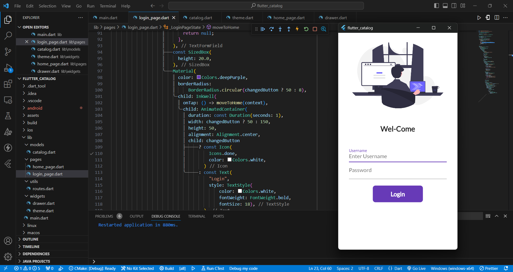
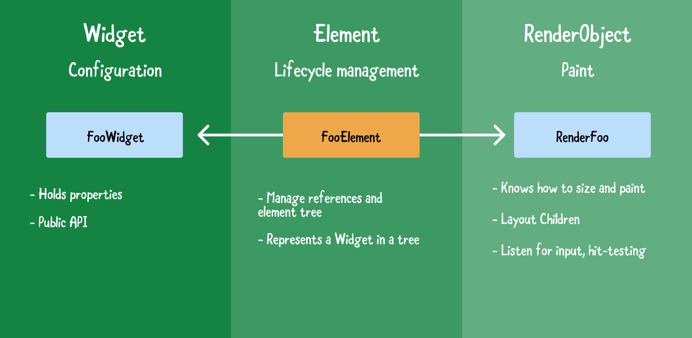
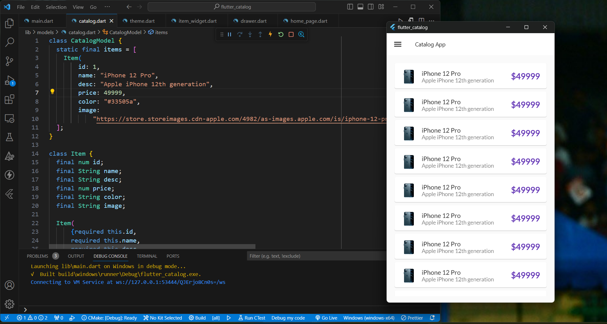

# 30-Days-of-Flutter

Day 01 :
Flutter Installation and Setup
First App

Day 02 :
Git, Dart Data types and Scaffold

Day 03 :
Functions, Classes, Routes, Theme & Text

Day 04 :
Adding Images, Google Fonts & Elevated Button

Day 05 :
Git and Github , SingleChildScrollView & Navigator

Day 06 :
Stateful , Animated Container and Future Dalay

Day 07 :
Q/A #30DaysOfFlutter

Day 8 : Form | Text Field Validation | Ink

<!--  -->



Day 9 : Material Drawer | DevTools | ListView

```dart
class MyDrawer extends StatelessWidget {
  const MyDrawer({super.key});

  @override
  Widget build(BuildContext context) {
    return Drawer(
      child: Container(
        color: Colors.deepPurple,
        child: ListView(
          padding: EdgeInsets.zero,
          children: const [
            DrawerHeader(
              padding: EdgeInsets.zero,
              child: UserAccountsDrawerHeader(
                margin: EdgeInsets.zero,
                accountName: Text("Aditya Shinde"),
                accountEmail: Text("adityashinde104@yahoo.com"),
                currentAccountPicture: CircleAvatar(
                  backgroundImage: NetworkImage(
                      "https://avatars.githubusercontent.com/u/94387380?s=400&u=11daaf4ba22c8a9b1e70fd55279e7b72fb486724&v=4"),
                ),
              ),
            ),
            ListTile(
              leading: Icon(
                CupertinoIcons.home,
                color: Colors.white,
              ),
              title: Text(
                "Home",
                textScaleFactor: 1.2,
                style: TextStyle(
                  color: Colors.white,
                ),
              ),
            ),
            ListTile(
              leading: Icon(
                CupertinoIcons.profile_circled,
                color: Colors.white,
              ),
              title: Text(
                "About",
                textScaleFactor: 1.2,
                style: TextStyle(
                  color: Colors.white,
                ),
              ),
            ),
            ListTile(
              leading: Icon(
                CupertinoIcons.mail,
                color: Colors.white,
              ),
              title: Text(
                "Contact",
                textScaleFactor: 1.2,
                style: TextStyle(
                  color: Colors.white,
                ),
              ),
            ),
          ],
        ),
      ),
    );
  }
}
```


added Circle Avatar in Drawer file.

```dart
currentAccountPicture: CircleAvatar(
                  backgroundImage: NetworkImage(
                      "https://avatars.githubusercontent.com/u/94387380?s=400&u=11daaf4ba22c8a9b1e70fd55279e7b72fb486724&v=4"),
                ),
```


Day 10 : App Bar Theme | Extracting Theme | Models

In these tutorial we learn the App Bar Theme. In lib folder created theme .dart file. In theme .dart file create a separate class for Theme and in these class we builds a light theme and dark theme and main .dart file pass the MyTheme() class.

code :

```dart
Theme.dart

import 'package:flutter/material.dart';
class MyTheme {
  static ThemeData lightTheme(BuildContext context) => ThemeData(
        primarySwatch: Colors.deepPurple,
        fontFamily: GoogleFonts.lato().fontFamily,
        appBarTheme: const AppBarTheme(
          color: Colors.white,
          elevation: 0.0,
          iconTheme: IconThemeData(color: Colors.black),
          titleTextStyle: TextStyle(color: Colors.black),
        ),
      );

  static ThemeData darkTheme(BuildContext context) => ThemeData(
        brightness: Brightness.dark,
      );
}
```

```dart
main.dart

themeMode : ThemeMode.light,
theme: MyTheme.lightTheme(context),
theme:MyTheme.darkTheme(context),
```

and also debug show checked mode banner value made it false it.

```dart
debugShowCheckedModeBanner = false;
```

.png>)

.png>)

Day 11 : Build Context, 3 Trees & Constraints Explained

Build Context is a locator that is used to track each widget in a tress and locate them and their position in the tree.

Flutter maintains three trees in parallel :

the **Widget , Element and Render Object trees**



Constraints :

A constraint is just a set of 4 doubles : a minimum width and maximum width, and a minimum height and maximum height.

Then the widget goes through its own list of children. One by one, the widget tells its children what their constraints are (which can be different for each child), and then asks each child what size it wants to be.

.png>)

.png>)

Day 12 : List View Builder, List Generate, Card & Asserts

List View builder : List View builder is for when you have a large set of items because it doesn’t build of them at once, and only builds the ones that are visible or are going to be visible.

List Generate : Generates a list of values. Creates a list with length positions and files it with values created by calling generator for each index in the range 0 … length -1 in increasing order.

```dart
final dummyList = List.generate(20, (index) => CatalogModel.items[0]);
```

Cards : Cards in flutter provides a Material design with various properties to play with and customize your widget such as elevation, border radius, child widget, and many more.



Day 13 : Local Files | Load & Decode JSON

First to Go in pebspec . yaml file and add packages under dependencies.

and create the model folder under the lib folder to keep data.

Manual JSON decoding refers to using the built-in-JSON decoder in dart: convert. It involves passing the raw JSON string to the json Decode() function, and then looking up the values you need in the resulting Map<String, dynamic>.

Code for the fetch Data :

```dart
class _HomePageState extends State<HomePage> {
  @override
  void initState() {
    super.initState();
    loadData();
  }

  loadData() async {
    var catalogJson = await rootBundle.loadString("assets/files/catalog.json");
    var decodedData = jsonDecode(catalogJson);
    var productsData = decodedData["products"];
  }
```


Day 14 : Q/A #30DaysOfFlutter
